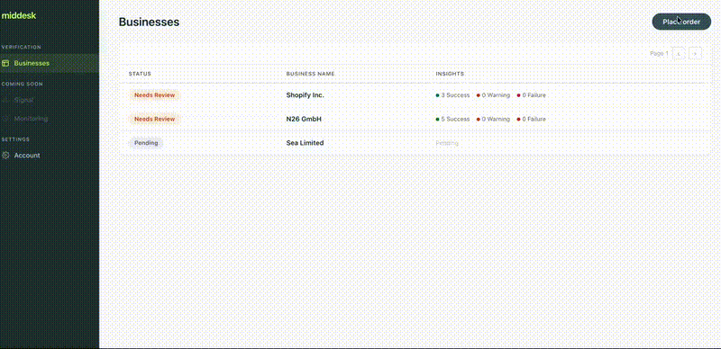

# International KYB Prototype

Interactive prototype for Middesk's International Know Your Business (KYB) verification product. This is a **prototype only** — it uses mock data and is intended for internal demos and design exploration, not production use.

## Demo



## What this covers

- **Order flow** — Full-page order creation matching the Middesk dashboard, with region/geography selection and jurisdiction-specific form fields
- **Business selection** — Intermediate page for selecting from multiple registry matches, with confidence scoring and ranked results
- **Auto-select threshold** — Configurable setting that automatically picks the top match when it exceeds a confidence score
- **Registration number guidance** — Contextual hints per jurisdiction (e.g. "don't use GST/HST") to help users provide the correct registry identifier
- **Settings** — Toggle for enabling/disabling International Search, plus the auto-select confidence threshold slider
- **Regions** — Canada (provincial jurisdictions), Core Europe, Extended Europe, APAC, Australia

## Branches

| Branch | Purpose | How to use |
|---|---|---|
| `main` | Clean prototype — order flow, business select, settings, mock data | Default demo branch. Run as-is for stakeholder walkthroughs |
| `explore/autocomplete-prototype` | Autocomplete search exploration with component library, dark/light theme, and smart-populated order forms | Checkout to demo the autocomplete UX direction |
| `explore/ux-tension-review` | Design review toolkit — annotated overlay, flow map, vendor gaps analysis, and state patterns reference | Checkout to walk designers through UX tension points and edge cases |

### `main`
The baseline prototype. Clean order flow with region selection, business search, and mock registry results across Canada, Core Europe, Extended Europe, and APAC.

### `explore/autocomplete-prototype`
Extends main with an autocomplete search experience — type-ahead matching against a mock identity index, smart-populated forms when a registration number is found, and the `@middesk/components` library integrated with theme support.

### `explore/ux-tension-review`
Design review branch with four tools for walking through UX considerations:

- **Design Review overlay** — Toggle button (bottom-right) that pins numbered annotations to UI elements. Each callout describes a design tension with persona-specific perspectives (Compliance, Ops, PM). Next/Prev navigates across pages with mock data injected automatically. Also activatable via `?review=true` query param.
- **Flow Map** (`/flow-map`) — Zoomed-out product flow diagram with tension points mapped to each stage. Click any tension to expand details, then "View in prototype" to jump to the live UI.
- **Vendor Gaps** (`/vendor-gaps`) — Table mapping 10 vendor-driven UX tensions to their root cause across Kyckr, AsiaVerify, and RegHub. Expandable rows show where each gap surfaces in the product.
- **State Patterns** (`/state-patterns`) — Reference of 35 UI states across 7 product areas that designers need to account for. Each state links to a sample order that demonstrates it.

Edge-case sample orders included:
- Gibraltar (empty report), Tencent/China (CJK characters), Quebec (French registry), Revolut (multi-jurisdiction cross-country), Shopify Federal (federal vs. provincial), SolarTech (corporate shareholders), Nordic Payments (no address + foreign status), Sea Limited (async/pending)

## Running locally

```bash
npm install
npm run dev
```

Opens at `http://localhost:5173/`.

> **Note:** This project depends on `@middesk/components` as a local file dependency (`../components`). Make sure the components repo is cloned as a sibling directory.

## Stack

- React 19 + Vite
- styled-components
- react-router-dom v7
- Mock data (no backend)

## This is a prototype

Everything here is hardcoded mock data. There are no API calls, no auth, no persistence. The goal is to explore UX patterns for international business verification before building the real thing.
