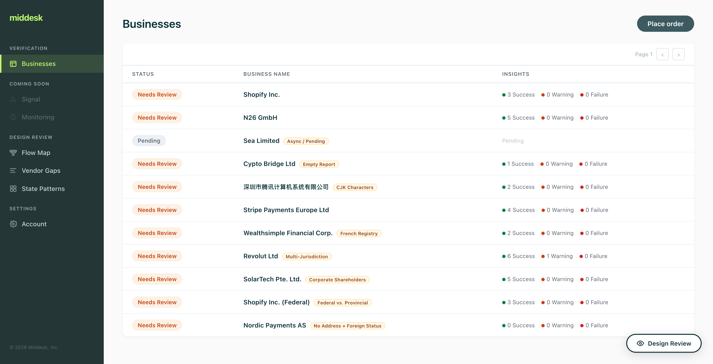
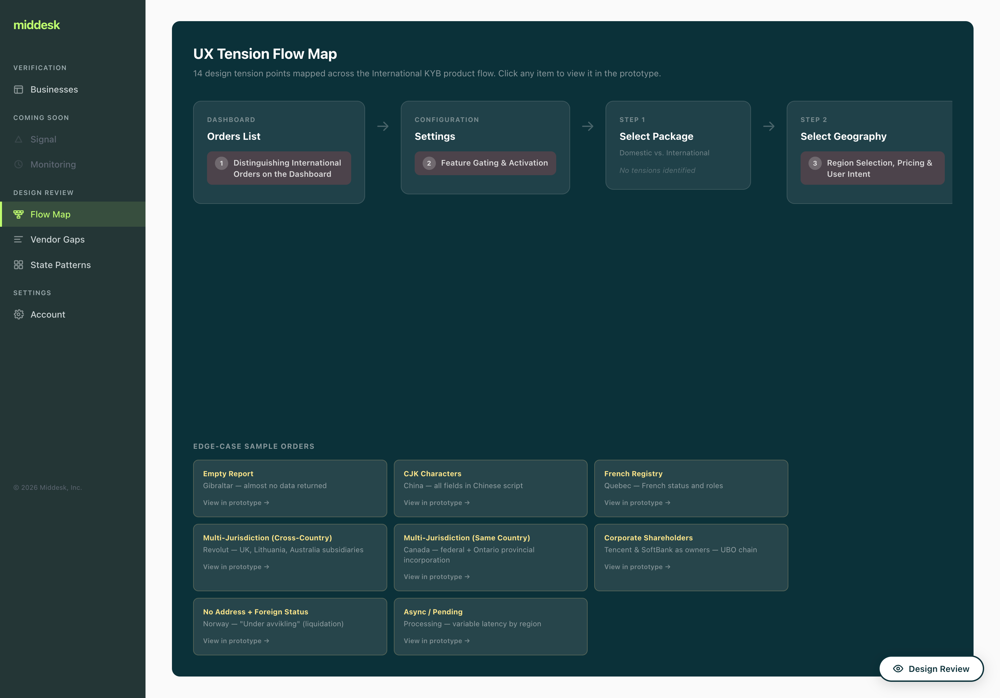
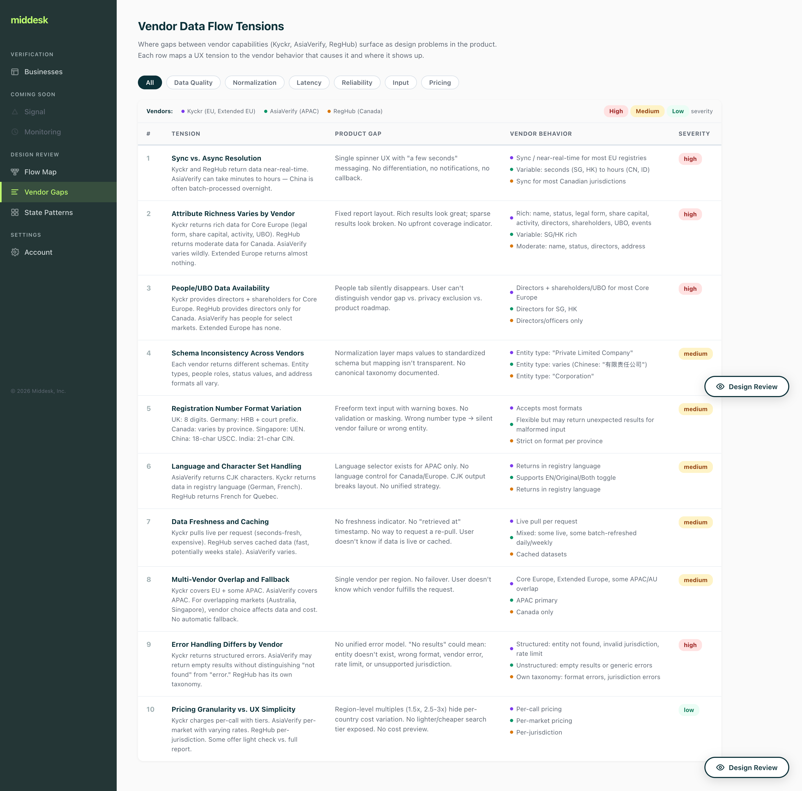

# International KYB Prototype

Interactive prototype for Middesk's International Know Your Business (KYB) verification product. This is a **prototype only** — it uses mock data and is intended for internal demos and design exploration, not production use.

## Demo


## What this covers

- **Order flow** — Full-page order creation matching the Middesk dashboard, with region/geography selection and jurisdiction-specific form fields
- **Business selection** — Intermediate page for selecting from multiple registry matches, with confidence scoring and ranked results
- **Auto-select threshold** — Configurable setting that automatically picks the top match when it exceeds a confidence score
- **Registration number guidance** — Contextual hints per jurisdiction (e.g. "don't use GST/HST") to help users provide the correct registry identifier
- **Settings** — Toggle for enabling/disabling International Search, plus the auto-select confidence threshold slider
- **Regions** — Canada (provincial jurisdictions), Core Europe, Extended Europe, APAC, Australia

## Branches

| Branch | Purpose | How to use |
|---|---|---|
| `main` | Prototype + design review tools | Default branch. Demo the product flow, or use the design review pages to walk through UX tensions |
| `explore/autocomplete-prototype` | Alternate order flow with type-ahead search | Checkout to demo a different UX direction for the order creation experience |

### `main`
The prototype with design review tooling baked in. Includes the full order flow (region selection, business search, mock registry results) plus design review pages accessible from the sidebar.

### `explore/autocomplete-prototype`
A competing UX direction that replaces the order form with an autocomplete search experience — type-ahead matching against a mock identity index, smart-populated forms when a registration number is found, and the `@middesk/components` library with theme support. This is a separate branch because it's a different product direction, not additive tooling.

## Design review tools (on `main`)

Built into the prototype for walking designers and stakeholders through UX considerations.

### Dashboard with edge-case orders

The orders list includes sample orders that demonstrate specific design challenges — each tagged with an amber label (Empty Report, CJK Characters, Multi-Jurisdiction, etc.). Click any order to see the edge case in context.



### Flow Map (`/flow-map`)

Zoomed-out product flow diagram with tension points mapped to each stage. Click any tension to expand details, then "View in prototype" to jump to the live UI. Edge-case sample orders listed at the bottom with direct links.



### Vendor Gaps (`/vendor-gaps`)

Table mapping 10 vendor-driven UX tensions to their root cause across Kyckr, AsiaVerify, and RegHub. Filter by category (Data Quality, Normalization, Latency, etc.). Click any row to expand and see where the gap surfaces in the product and detailed vendor behavior.



### Design Review overlay

Toggle button (bottom-right, "Design Review") that pins numbered annotations to UI elements. Each callout describes a design tension with persona-specific perspectives (Compliance, Ops, PM). Next/Prev navigates across pages with mock data injected automatically. Also activatable via `?review=true` query param.

### State Patterns (`/state-patterns`)

Reference of 35 UI states across 7 product areas that designers need to account for. Each state shows what triggers it, which vendor causes it, and links to a sample order that demonstrates it.

## Related resources

- [International KYB PRD](https://docs.google.com/document/d/1AECwXw8cHqfuwkcs3_HuuV5BEyx5eBr-U8SHd5j-GE0/edit?tab=t.0#heading=h.il9g0qjetxma) — Product requirements document
- [International Product — Data Flows (Figma)](https://www.figma.com/board/DuR3IlExACEaD5kFQ07d44/International-Product---Data-Flows?node-id=5-30) — API order flows across vendors (Kyckr, AsiaVerify, RegHub)

## First-time setup

If you've never used Git or GitHub on your machine, Claude Code can walk you through it. If you already have SSH keys and Node.js, skip to "Running locally."

### 1. Install Claude Code and prerequisites

Open Terminal (Cmd + Space, type "Terminal") and run:
```bash
brew install node
npm install -g @anthropic-ai/claude-code
```

### 2. Let Claude Code set up Git and GitHub

Start Claude Code from any directory:
```bash
claude
```

Then ask it to set you up:
- "Help me set up Git and SSH keys for GitHub. My email is name@middesk.com"
- Claude will check if you already have keys, generate them if needed, and walk you through adding them to GitHub
- It will also configure your Git name and email

If you'd rather do it manually, the steps are:
1. Generate a key: `ssh-keygen -t ed25519 -C "your.email@middesk.com"` (press Enter through the prompts)
2. Copy it: `pbcopy < ~/.ssh/id_ed25519.pub`
3. Add it at [GitHub → Settings → SSH Keys → New SSH Key](https://github.com/settings/keys)
4. Set your identity: `git config --global user.name "Your Name"` and `git config --global user.email "your.email@middesk.com"`

### 3. Clone and run the prototype

Ask Claude Code:
- "Clone the middesk/international-prototype repo and start the dev server"

Or run manually:
```bash
git clone git@github.com:middesk/international-prototype.git
cd international-prototype
npm install --legacy-peer-deps
npm run dev
```

Opens at `http://localhost:5173/`.

## Running locally

If you've already cloned the repo:
```bash
cd international-prototype
npm install --legacy-peer-deps
npm run dev
```

Opens at `http://localhost:5173/`. No additional dependencies or sibling repos needed.

## Making changes with Claude Code

This prototype is designed to be modified by PMs and designers using [Claude Code](https://docs.anthropic.com/en/docs/claude-code) — no coding experience required. Claude Code is a CLI tool that reads your codebase and makes changes based on natural language instructions.

### Setup

1. Install Claude Code:
   ```bash
   npm install -g @anthropic-ai/claude-code
   ```

2. Navigate to this project and start Claude Code:
   ```bash
   cd international-prototype
   claude
   ```

3. Describe what you want in plain language. Examples:
   - "Add a new sample order for a Japanese company with CJK characters"
   - "Change the region selection to show flat prices instead of multiples"
   - "Add a new tension point about monitoring to the flow map"
   - "Make the People tab always visible with an explanation when empty"
   - "Add a new row to the Vendor Gaps page about address formatting"

Claude will read the relevant files, propose changes, and ask for your approval before editing.

### Tips

- **Be specific about what you want**, not how to code it. "Add a warning when the report has fewer than 3 fields" is better than "edit OrderDetailPage.jsx."
- **Reference existing patterns.** "Add a new edge-case order like the Gibraltar one, but for Japan" — Claude will find and follow the pattern.
- **Run the dev server first** (`npm run dev`) so you see changes live. Vite hot-reloads automatically.
- **Ask Claude to explain first.** "What files would I need to change to add a new design review page?" gives you context before committing.

### Branching and version control

Use branches to keep experiments separate from the working prototype.

**Create a branch before exploring a new direction:**
```bash
git checkout -b explore/your-experiment-name
```

Name branches descriptively: `explore/monitoring-ux`, `explore/ubo-flow`, `explore/pricing-redesign`.

**Commit your work** — ask Claude Code:
- "Commit what we've done so far"
- "Commit and push to GitHub"

Or manually:
```bash
git add -A
git commit -m "Add monitoring page with alert states"
git push -u origin explore/your-experiment-name
```

**When to branch vs. commit to `main`:**

| Scenario | What to do |
|---|---|
| Adding design review pages, tensions, state patterns, edge-case orders | Commit to `main` — reference tooling, not a product direction |
| Exploring an alternative UX flow | New `explore/` branch — keeps main clean |
| Redesigning a core interaction | New branch — competing direction |

**Get back to a clean state:**
```bash
git checkout main
git pull
npm run dev
```

**If something breaks**, ask Claude Code: "Something is broken, can you fix it?" — it can read errors and debug.

### Collaboration

1. Create a branch for your exploration
2. Make changes with Claude Code
3. Ask Claude to commit and push
4. Share the branch name with others — they can check it out and run locally
5. If the exploration is worth keeping, merge into `main`

## Stack

- React 19 + Vite
- styled-components
- react-router-dom v7
- Mock data (no backend)

## This is a prototype

Everything here is hardcoded mock data. There are no API calls, no auth, no persistence. The goal is to explore UX patterns for international business verification before building the real thing.
